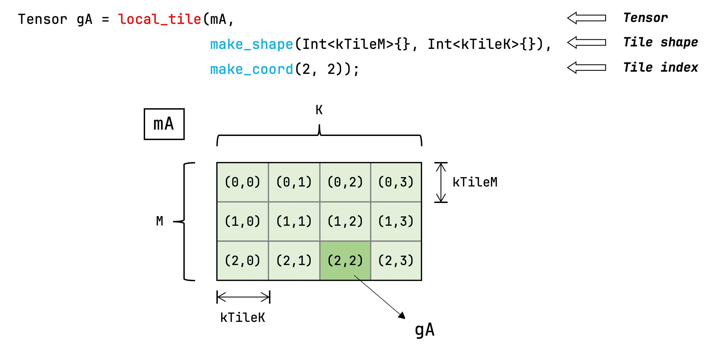
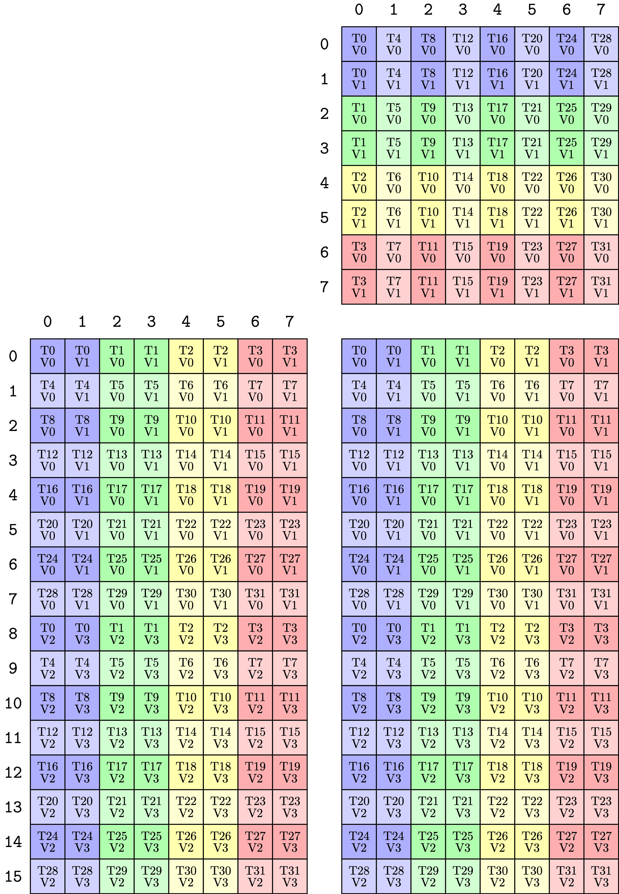
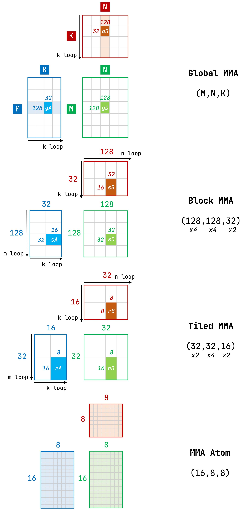
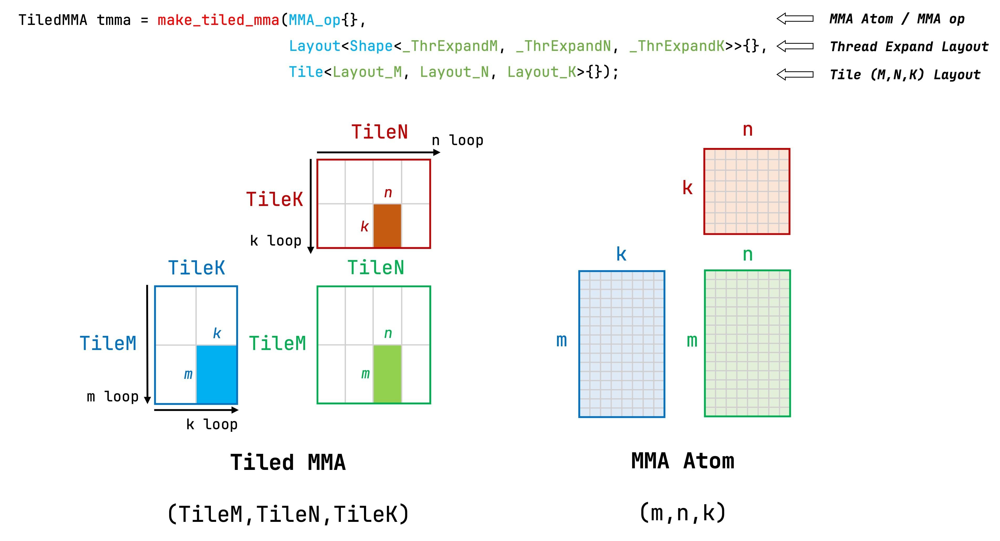

# CUTLASS: GEMM Kernel by CUTE

## 1. CuTe 基础组件

### 1.1 Tensor 和 Layout

Tensor 中的张量在内存的存储结构就是一种 Layout，它包括了 Shape 和 Stride 两个部分。CuTe 中的张量可以通过下面的方式来创建

```cpp
Tensor mA = make_tensor(make_gemm_ptr(Aptr),
												make_shape(Int<3>{}, Int<4>{}),
												make_stride(Int<1>{}, Int<3>{}));
```

### 1.2 Tiling API

在大规模的矩阵运算中，需要将矩阵进行分块处理，也就是 tiling。在 CuTe 中，我们可以直接使用 `local_tile` 来实现对 Tensor 的分块。

- 第 2 个参数表示切分块的 shape
- 第 3 个参数表示块的索引

```cpp
Tensor gA = local_tile(mA,
											 make_shape(Int<kTileM>{}, Int<kTileK>{}), // tile shape
											 make_coord(2, 2));
```



> **Note**: `Int<N>{}` 的作用是将一个 数值 转变成一个 数据类型，这样做的好处是 
1. 可以将大部分的数据从运行期搬到编译期实现 
2. CuTe 可以通过传入的不同数据类型，比如 `Int<64>{}` 和 `Int<128>{}` ，来实现模板类的不同实例化。
> 

上面的方式对矩阵 A/B/C 分块需要设计不同的 **tile shape**，比如下面这样

```cpp
Tensor gA = local_tile(mA,
											 make_shape(Int<kTileM>{}, Int<kTileK>{}), // tile shape
											 make_coord(2, 2));
Tensor gB = local_tile(mB,
											 make_shape(Int<kTileK>{}, Int<kTileN>{}), // tile shape
											 make_coord(2, 2));
Tensor gC = local_tile(mC,
											 make_shape(Int<kTileM>{}, Int<kTileN>{}), // tile shape
											 make_coord(2, 2));
```

除了上面的方法，我们还可以用一个高维的 `tiler`，并传入 `Step` 在指定维度上进行分块，这样分块处理可以复用同一个 `tiler` 和 `coord`

```cpp
auto tiler = make_tile(Int<kTileM>{}, Int<kTileN>{}, Int<kTileK>{});
auto coord = make_coord(0, 0, 0);

Tensor gA = local_tile(mA, tiler, coord, Step<_1, X, _1>{});
```

> Note: `make_tile` 和 `make_coord`，包括上面的 `make_shape` 和 `make_stride`，最终返回的都是一个 `cute::tuple` 类型的值，而 `Tile`、`Coord`、`Shape`、`Stride`、`Step` 类都是 `cute::tuple` 的别名，因此可以用相同的方法使用它们。
> 

### 1.3 MMA API

CuTe 中的 `MMA_Atom` 对象对应一个特定的 mma 指令，例如我们需要完成的 $16 \times 16 \times 8$ 的 MMA 运算，且所有的数值精度均为 FP16，那么首先需要创建一个 `MMA_op`

```cpp
using MMA_op = SM80_16x8x8_F16F16F16F16_TN;
```

其对应的 mma 指令如下：

```cpp
mma.sync.aligned.m16n8k8.row.col.f16.f16.f16.f16
  {%Rd0, %Rd1},
  {%Ra0, %Ra1},
  {%Rb0},
  {%Rc0, %Rc1};
```

一个 mma 指令需要一个 warp（32个线程） 协作完成，每个线程需要从 A/B/C 矩阵中获取指定位置上的元素，并存入寄存器中，再将寄存器喂给 mma 指令。比如计算 $16 \times 16 \times 8$ 矩阵乘法的时候，每个线程需要 4 个矩阵 A 元素、4 个矩阵 B 元素、8 个矩阵 C 元素。下图显示了矩阵元素与每个寄存器中寄存器的映射关系。



可以发现的是，如果使用手动的方法将矩阵元素映射到对应的线程寄存器上，是非常困难的。而 CuTe 帮助我们做到了这点，在 Layout Algebra 的加持下，CuTe 提供的 MMA API 帮助我们建立了上述复杂的映射关系。

我们只需要将正确的 `MMA_op` 传递给 `make_tiled_mma` 函数，获取到 `TiledMMA` 对象，而这一对象可以帮助每个线程索引到正确的矩阵元素。

```cpp
using TiledMMA = decltype(make_tiled_mma(MMA_op{}));
```

> **Note**: 需要注意的是，上面 `make_tiled_mma` 只接收了 `MMA_op` 1 个参数，而实际上这个函数可以接收 3 个参数。这边只写了 1 个参数的原因是，每个 block 中只有 1 个 warp，并且每个 warp 只负责进行 1 mma 指令计算。对 `make_tiled_mma` 其他参数的介绍会在第 3 节做出介绍。
> 

`TiledMMA` 的实例化是在每个 kernel 函数当中执行的，并通过 `get_slice` 拿到对应线程的 tiler（即 CuTe 的 `ThrMMA` 实例）。调用这个 tiler 的 `partition_A` 方法，就拿到了该线程完成 MMA 计算所需的 A 矩阵元素的 Tensor 表示，这个 Tensor **表示了 global memory 上 A 矩阵对应到这个线程的分片**。相应还有 `partition_B`、`partition_C` 方法，它们的作用类似。

```cpp
TiledMMA tiled_mma;
ThrMMA thr_mma = tiled_mma.get_slice(tid);

Tensor tCgA = thr_mma.partition_A(gA);  // (MMA, MMA_M, MMA_K)
// MMA     1 个原子操作需要的数据
// MMA_M   M 方向重复的次数
// MMA_K   K 方向重复的次数
```

`ThrMMA` 还有一个 `partition_fragment_A` 方法，它返回的 Tensor 的 shape 和 partition_A 相同，但是这个 Tensor 不表示 `global memory` 的数据，而是表示线程内的一组连续的寄存器。

```cpp
Tensor tCrA = thr_mma.partition_fragment_A(gA);  // (MMA, MMA_M, MMA_K)
```

### 1.4 Copy API 与 GEMM API

<aside>
💡

本文中 Copy API 的介绍是为了实现最简单的 GEMM，因此比较简单。

</aside>

可以用 CuTe 提供的 Copy API 完成数据的拷贝。例如下面的代码完成了数据从 global memory 到寄存器的拷贝：

```cpp
auto copy_atom = AutoVectorizingCopy{};
copy(copy_atom, tCgA, tCrA);
```

数据就绪后，我们可以调用 CuTe GEMM API 进行 mma 的计算：

```cpp
gemm(tiled_mma, tCrD, tCrA, tCrB, tCrC);
```

随后，我们可以将结果写回 global memory：

```cpp
copy(copy_atom, tCrD, tCgD);
```

## 2. Minimal GEMM Kernel

### 2.1 代码实现

本节中需要解决的问题比较简单，因此代码实现也是非常简单。从下面的表格可以看出，我们使用 mma 指令 `mma.sync.aligned.m16n8k8.row.col.f16.f16.f16.f16` ，并且需要我们计算的矩阵规模也是 $16 \times 16 \times 8$ ，因此不需要 tiling。

| 问题规模 | (16, 8, 8) |
| --- | --- |
| 算子精度 | fp16 = fp16 * fp16 + fp16 |
| Grid shape | (1, 1, 1) |
| Block shape | (32, 1, 1) |
| Block tile shape | (16, 8, 8) |
| Tiled MMA shape | (16, 8, 8) |
| MMA Atom shape | (16, 8, 8) |

具体的代码实现位于[这里](https://github.com/xiaozhenxu/cuda-learning/blob/main/cute/00_simple_gemm/simple_gemm.cu)。

### 2.2 性能分析

TODO

## 3. 混合精度 GEMM Kernel

TODO

## 4. CUTE 下的三级 Tiling 模型

在 2.1 的表格中已经提到过，CUTE 在实现 GEMM 的时候，进行了三级 Tiling，包括 MMA Atom shape、Tiled MMA shape 和 Block Tile shape。

- **MMA Atom shape**: 对底层 PTX mma 指令的封装
- **Tiled MMA shape**: 由 MMA Atom 在 MNK 维度的 **排布方式** 和 **执行次数** 共同组成
- **Block Tile shape**: 在一个 block 当中，也就是一个 kernel 函数内，通过迭代的方式串行执行 Tiled MMA，共同组成了一个 Block 来负责的 tile



### 4.1 Tiled MMA

在本小节中，我们将首先扩展 MMA Atom 来获得更大尺寸的 Tiled MMA，而这一步骤可以通过函数 `make_tiled_mma` 实现。

如上所述，Tiled MMA 是由 MMA Atom 在 MNK 维度改变 **排布方式** 和 **执行次数** 得到的。排布方式的改变其实就是增加\/减少 warp 数量，也就是增加\/并发数量，而执行次数的改变其实就是增加\/减少单个 warp 执行 MMA Atom 的次数，也就是增加\/串行执行数量。

#### make_tiled_mma API

在 1.2 小节中，实现了一个很简单的矩阵乘法，这个矩阵 shape 和 MMA Atom shape 是一样的，因此 `make_tiled_mma` 的使用非常简单，表示获得的 Tiled MMA shape 和 MMA Atom shape 是一样的

```jsx
using TiledMMA = decltype(make_tiled_mma(MMA_op{}));
```

而实质上， `make_tiled_mma` 除了 `MMA_op` 还可以接受两个参数 `MMAThrLayout` 和 `MMATileLayout` 



- `MMA_op` 通常对应一个原子指令，与 `MMA_traits` `MMA_atom` 一一对应，封装了指令对应的数据处理形状、数据类型、线程数量等
- `MMAThrLayout` cute当中的 `layout` 对象，规定了在 m n k 方向原子块(Atom)的堆叠数量，通过这个可以计算得到处理该 tile 的线程总数量
- `MMATileLayout` cute当中的 `layout` 对象，表明了待处理 tile 在 m n k 方向上的 shape

#### 代码实现

相比于 Minimal GEMM Kernel，本小节主要是扩展 Tiled MMA shape，当然也扩展待处理矩阵的大小，但是保持了 Block Tile shape 和 Tiled MMA shape 是一致的。

| 问题规模 | (32, 32, 16) |
| --- | --- |
| 算子精度 | bf16 = bf16 * bf16 + fp32 |
| Grid shape | (1, 1, 1) |
| Block shape | (256, 1, 1) |
| Block tile shape | (32, 32, 16) |
| Tiled MMA shape | (32, 32, 16) |
| MMA Atom shape | (16, 8, 8) |

这块的修改非常简单，相比于 Minimal GEMM Kernel，只需要修改 `make_tiled_mma` 来获得新的 `TiledMMA` 就好。

```jsx
using namespace cute;

using MMA_op = SM80_16x8x8_F32BF16BF16F32_TN;
using MMA_traits = MMA_Traits<MMA_op>;
using MMA_atom = MMA_Atom<MMA_traits>;
using MMA_shape = MMA_traits::Shape_MNK;

static constexpr int kMmaThrExpandM = 2;
static constexpr int kMmaThrExpandN = 4;
static constexpr int kMmaThrExpandK = 1;

static constexpr int kMmaValExpandM = 1;
static constexpr int kMmaValExpandN = 1;
static constexpr int kMmaValExpandK = 2;
                                                     
static constexpr int kMmaTileM = kMmaThrExpandM * kMmaValExpandM * get<0>(MMA_shape{});
static constexpr int kMmaTileN = kMmaThrExpandN * kMmaValExpandN * get<1>(MMA_shape{});
static constexpr int kMmaTileK = kMmaThrExpandK * kMmaValExpandK * get<2>(MMA_shape{});

using MMAThrLayout = decltype(make_layout(make_shape(Int<kMmaThrExpandM>{},
                                                     Int<kMmaThrExpandN>{},
                                                     Int<kMmaThrExpandK>{})));
using MMATileLayout = Tile<Int<kMmaTileM>, Int<kMmaTileN>, Int<kMmaTileK>>;
using TiledMMA = decltype(make_tiled_mma(MMA_op{}, MMAThrLayout{}, MMATileLayout{}));
```

完整的代码在[这里](https://github.com/xiaozhenxu/cuda-learning/blob/main/cute/02_tiled_mma/tiled_mma.cu)

### 1.3 MMA API

`MMA_Atom` 代表了硬件（通常是 Tensor Core）能够执行的最小、不可分割的矩阵乘法操作单元。 `MMA_Atom` 是用来描述 `mma.sync` 指令的软件对象，它封装了：

- 指令形状（shape）: 例如 m16_n8_k16
- 数据类型: 例如 A 是 fp16，C 是 fp32
- 线程布局: 一个 warp 中每个线程负责哪些数据。包括 32 个线程如何持有 A B C 矩阵的数据片段

对于 Tensor Core 的一条 `mma.sync` 指令来说，需要将一个 warp 负责的矩阵数据切分到对应线程的对应寄存器上，然后再运行该指令。而 `MMA_Atom` 相当于已经将数据切分的操作封装起来了。

```cpp
using MMA_op = MMA_Atom<SM80_16x8x16_F32F16F16F32_TN>;
```

硬件的 Tensor Core 指令可以处理的矩阵很小，因此需要多个 Warp 的堆叠来处理更大维度的矩阵

```cpp
// M = 16 * 2 = 32
// N =  8 * 2 = 16
// K = 16 * 1 = 16
// TiledMMA 可以处理 32*16*16 的矩阵

using TiledMMA = decltype(make_tiled_mma(
									MMA_op{},
									Layout<Shape<2,2,1>>{}
								 )):
```

上面的代码定义了 `MMA_op` `TiledMMA` 通过下面的步骤可以让每个线程很方便地寻址到自己需要负责的数据

```cpp
// 1. 在 kernel 内部实例化
TiledMMA tiled_mma;

// 2. 获取当前线程的任务
auto thr_mma = tiled_mma.get_slice(thread_idx);

// 3. 数据切片
auto tAsA = thr_mma.partition_A(sA);  // 每块线程应该去读那一块地址
auto tBrA = thr_mma.partition_fragment_A(sA);  // 每个线程用来存放数据的寄存器
```